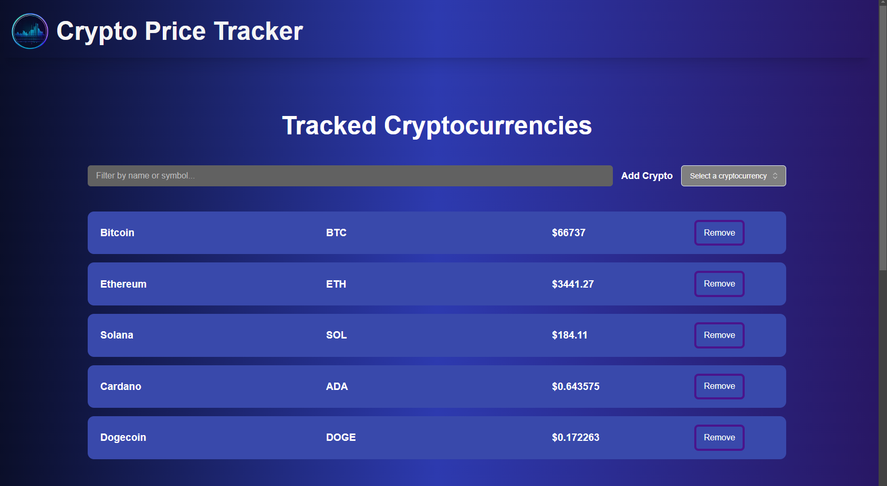

# Crypto Price Tracker

## Overview

Crypto Price Tracker is a simple web application built with TypeScript and React.js that allows users to track cryptocurrency prices. Users can select and deselect cryptocurrencies to monitor their prices in real-time.



## Features

- Select and deselect cryptocurrencies to track
- Filter cryptocurrencies by name and symbol
- Real-time price tracking (updates every 60 seconds)
- Price Chart from multiple timeframes
- Simple and intuitive user interface

## Technologies Used

- TypeScript
- React.js
- Vite.js
- TailwindCSS
- Material Tailwind
- Shadcn
- Tanstack React Query

## Setup Instructions

### Prerequisites

Make sure you have Node.js and npm installed on your machine.

### CoinGecko API Setup

You also need to create a Demo API account in CoinGecko API.

1. **Create an account:**
   Visit the [CoinGecko API registration page](https://support.coingecko.com/hc/en-us/articles/21880397454233-User-Guide-How-to-sign-up-for-CoinGecko-Demo-API-and-generate-an-API-key) and follow the instructions to sign up for a Demo API account.

2. **Obtain an API key:**
   After creating an account, follow the steps outlined in the guide to generate your API key from the CoinGecko dashboard.

3. **Use the API key in the .env file:**
   Create a `.env` file in the root directory of your project if it doesn't already exist. Add your CoinGecko API key to the `.env` file.

### Installation

1. **Navigate to the project directory:**

   ```bash
   cd crypto-price-tracker
   ```

2. **Install dependencies:**

   ```bash
   npm install
   ```

3. **Start the development server:**

   ```bash
   npm run dev
   ```

4. **Open your browser and navigate to the localhost displayed on the terminal to view the application.**

5. **Select the cryptocurrencies you want to track and monitor their prices in real-time.**
